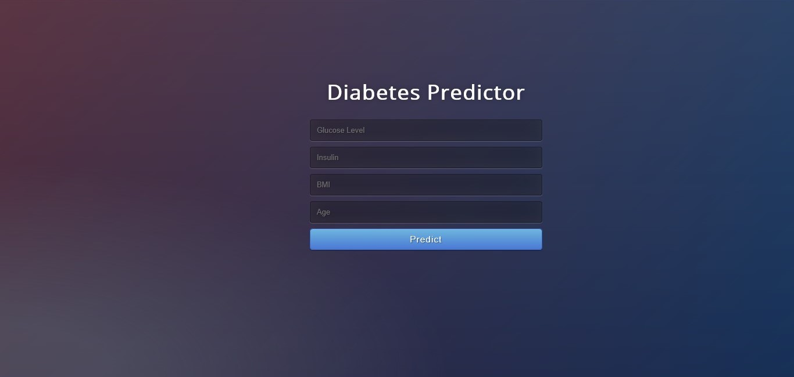

## Diabetes Predictor
> Predict Diabetes using Machine Learning.

In this project, our objective is to predict whether the patient has diabetes or not based on various features like *Glucose level, Insulin, Age, BMI*. We will perform all the steps from *Data gathering to Model deployment.* During Model evaluation, we compare various machine learning algorithms on the basis of accuracy_score metric and find the best one. Then we create a web app using Flask which is a python micro framework.


> Read more about it in my [Blogpost](https://medium.com/@adityamankar09/building-a-diabetes-predictor-4702b99bc7e4).

### Integration with Datavista

This diabetes predictor is integrated into the Datavista platform. To access it, run the main Datavista Flask app and navigate to the Diabetes page.

The Diabetes page now supports two modes:

- Basic mode: legacy 4-feature predictor (Glucose, Blood Pressure, Insulin, BMI)
- Advanced mode: tuned Random Forest with engineered features from the advanced pipeline

To use Advanced mode from the web app, run the advanced pipeline once so the model artifacts are generated.

## Advanced Workflow (EDA + SMOTE + Tuning + SHAP)

An end-to-end advanced pipeline is available at:

`DIABETES PREDICTION/advanced_diabetes_pipeline.py`

It includes:

- Exploratory Data Analysis (EDA)
- Feature engineering and selection
- Baseline model comparison (Logistic Regression, Random Forest, XGBoost)
- Class imbalance handling with SMOTE
- Hyperparameter tuning with RandomizedSearchCV
- Best-model evaluation + confusion matrix
- SHAP explainability

### Expected Dataset

This advanced script expects the Kaggle diabetes prediction dataset with columns like:

`gender, age, hypertension, heart_disease, smoking_history, bmi, HbA1c_level, blood_glucose_level, diabetes`

Download it and place it in `DIABETES PREDICTION/diabetes_prediction_dataset.csv`, or pass a custom path with `--data-path`.

### Run Command

From repository root:

```bash
python "DIABETES PREDICTION/advanced_diabetes_pipeline.py" --data-path "DIABETES PREDICTION/diabetes_prediction_dataset.csv"
```

Optional flags:

- `--output-dir` to choose where plots/reports/artifacts are saved.
- `--show-plots` to display figures interactively while running.

Outputs are saved under:

`DIABETES PREDICTION/outputs/advanced_pipeline/`

# **Screenshot**



# Standalone Installation

- Clone this repository and unzip it.

- After downloading, `cd` into the `flask` directory.

- Begin a new virtual environment with Python 3 and activate it.

- Install the required packages using
   `pip install -r requirements.txt`

- Execute the command:
   `python app.py`

- Open http://127.0.0.1:5000/ in your browser.
